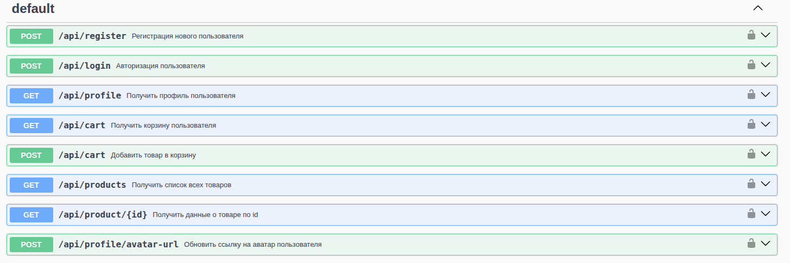

# 🛒 ZStore

## https://zstore.site/

**ZStore** — это полнофункциональное веб-приложение интернет-магазина, созданное на **Node.js (Express)** и **React (TypeScript)**.  
Проект реализует базовую архитектуру клиент-серверного приложения с REST API, авторизацией JWT и модульной структурой.

---

---

## 📦 Технологии

### Backend (`/app`)

- **Node.js**, **Express.js**
- **JWT** — аутентификация и авторизация
- **dotenv** — управление переменными окружения
- **Swagger** — автодокументация API
- **PostgreSQL + TypeORM** — База данных
- **Docker / docker-compose** — контейнеризация

### Frontend (`/client`)

- **React + TypeScript**
- **React Router** — маршрутизация
- **Axios** — взаимодействие с API
- **CSS Modules / Custom Styles**
- **Hooks / Context API (store)** — управление состоянием

### CI-CD\Tests

- **CI/CD** — GitHub Actions + SSH Deploy
- **Testing** — Jest

---

## 📂 Структура проекта

<pre>
📦 zstore
├── server/                # Backend
│   └── app/
│       ├── config/            # Конфиги (JWT, DB, ENV, Swagger)
│       ├── controllers/       # Логика обработки запросов
│       ├── middlewares/       # JWT и обработка ошибок
│       ├── routes/            # Определения маршрутов (user.routes.js)
│       ├── services/          # Сервисы и бизнес-логика
│       ├── models/            # Модели Sequelize
│       ├── test/              # Тесты
│       ├── server.js          # Точка входа Express
│       ├── app.js             # Основное приложение Express
│       └── .env               # Переменные окружения
│ 
│
├── client/                # Frontend
│   ├── src/
│   │   ├── components/    # UI компоненты (Header, Footer)
│   │   ├── pages/
│   │   │   ├── HomePage.tsx
│   │   │   ├── CatalogPage.tsx
│   │   │   ├── ProductPage.tsx
│   │   │   ├── LoginPage.tsx
│   │   │   ├── ProfilePage.tsx
│   │   │   └── ContactPage.tsx
│   │   ├── services/      # Взаимодействие с API
│   │   ├── store/         # Хранилище состояния
│   │   ├── types/         # Общие интерфейсы и типы
│   │   ├── styles/        # Стили
│   │   └── utils/         # Вспомогательные функции
│   └── public/            # Статические файлы
│
├── .gitignore
├── package-lock.json       # Eslint+prettier
├── package.json            # Eslint+prettier
├── docker-compose.yml      # Конфигурация docker-compose
├── Dockerfile              # Dockerfile для контейнера
├── dump.sql                # SQL-дамп базы данных
└── README.md
</pre>

## 🔒 API Endpoints

****

## 🧱 Архитектура

**Проект построен по принципам:**

**MVC (Model-View-Controller)** — для backend-части

**Feature-based structure** — для frontend-части

**Разделение ответственности по слоям** — (controllers, services, routes, middlewares, tests, models)

## 👤 Автор

- **Kyte4**
- **🔗 GitHub: [Kyte4](https://github.com/Kyte4)**
- **📨 Telegramm: https://t.me/kyte4**
